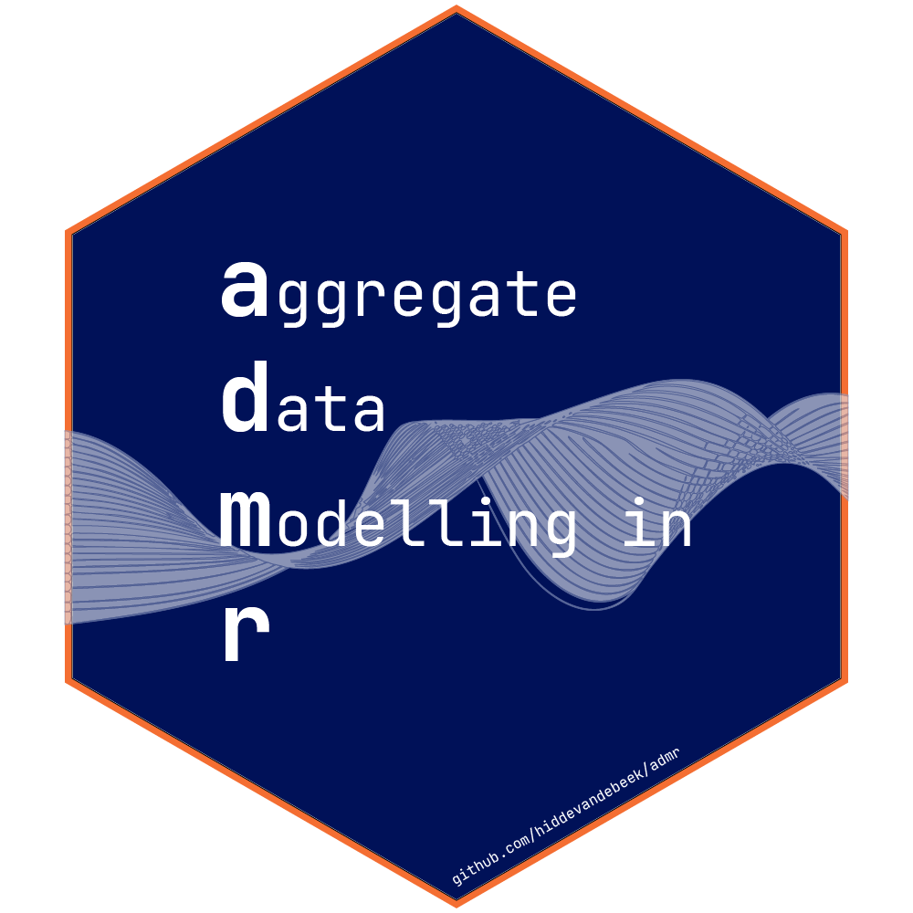

<!-- README.md is generated from README.Rmd. Please edit that file -->

```{r, include = FALSE}
knitr::opts_chunk$set(
  collapse = TRUE,
  comment = "#>",
  fig.path = "man/figures/README-",
  out.width = "100%"
)
```

# admr: Aggregate Data Modeling in R 

<!-- badges: start -->
<!-- badges: end -->

admr (Aggregate Data Modeling in R) is an open-source R package designed to facilitate pharmacometric modeling using summary-level data. It enables users to work with aggregate data, such as mean observations and variance-covariance matrices, to fit pharmacokinetic and pharmacodynamic (PK/PD) models efficiently. This package implements a newly developed Expectation-Maximization (EM) algorithm to enhance computational performance and provides tools for advanced modeling applications.

**Features**

-   Expectation-Maximization Algorithm: Efficiently fits pharmacometric models to aggregate data, improving speed and scalability compared to Monte Carlo methods.

-   Aggregate Data Flexibility: Allows for the integration of summary-level data from diverse sources, including published literature and simulated models.

-   Meta-Analysis Support: Facilitates model-based meta-analyses by enabling the combination of summary data across studies.

-   R Integration: Fully compatible with R, leveraging popular pharmacometric modeling libraries like rxode2.

-   Open-Source: Developed for accessibility and ease of use by the pharmacometric community.

## Installation

This is an *R* package. [*R*](https://www.r-project.org/) is required, [*RStudio*](https://posit.co/downloads/) is recommended.

You can install the development version of admr from [GitHub](https://github.com/) with:

``` r
# install.packages("devtools")
devtools::install_github("hiddevandebeek/admr")
```

## Example

Below is a basic example of how to use admr to fit a pharmacokinetic model to aggregate data:

```{r example}
library(admr)
## basic example code
```
