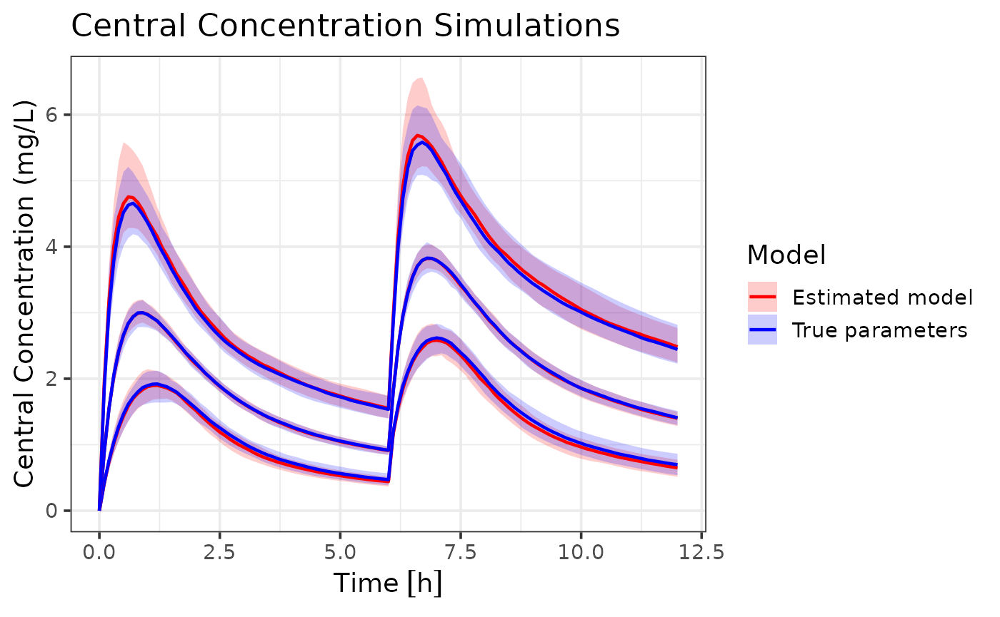

# Get started with admr

## Introduction to Aggregate Data Modeling with `admr`

This vignette provides a comprehensive introduction to using the `admr`
package for aggregate data modeling in population pharmacokinetics.
We’ll cover the basic concepts, data preparation, model specification,
and make a link to more advanced features.

### What is Aggregate Data Modeling?

Aggregate data modeling is a new approach in pharmacometrics that allows
you to work with summary-level data instead of individual-level
observations. This is particularly useful when:

- Individual-level data is not available (e.g., from published
  literature)
- You need to combine data from multiple studies
- You want to perform meta-analyses
- You’re working with simulated data and want to reduce computational
  burden

The `admr` package implements the Iterative Reweighting Monte Carlo
(IRMC) algorithm, which efficiently fits models to aggregate data by
iteratively updating parameter estimates using weighted importance
sampling. This is more efficient than traditional Monte Carlo methods.

### Required Packages

The first step is to load the necessary packages:

Click here

``` r
library(admr)
library(rxode2)
library(nlmixr2)
library(dplyr)
library(tidyr)
library(mnorm)
library(ggplot2)  # For visualization
library(randtoolbox)
library(units)
```

### Understanding the Data Format

The `admr` package works with two types of data formats:

1.  **Raw Data**: Individual-level observations in a wide or long
    format.
2.  **Aggregate Data**: Summary statistics (mean and covariance)
    computed from raw data.
3.  **Aggregate Data with only means and variance**: Mean and variance
    for each time point (no covariances).

The vignette [Variance-only based
modelling](https://vanhasseltlab.github.io/admr/articles/variance.html)
provides more details on the third option.

Let’s look at the examplomycin dataset, which we’ll use throughout this
vignette:

``` r
# Load the dataset
data(examplomycin)
head(examplomycin)
```

    ##    ID TIME    DV AMT EVID CMT
    ## 1 460 0.00 0.000 100  101   1
    ## 2 460 0.10 0.752   0    0   2
    ## 3 460 0.25 1.932   0    0   2
    ## 4 460 0.50 3.694   0    0   2
    ## 5 460 1.00 3.479   0    0   2
    ## 6 460 2.00 4.003   0    0   2

``` r
# Basic dataset information
cat("Number of subjects:", length(unique(examplomycin$ID)), "\n")
```

    ## Number of subjects: 500

``` r
cat("Number of time points:", length(unique(examplomycin$TIME)), "\n")
```

    ## Number of time points: 10

``` r
cat("Time points:", paste(sort(unique(examplomycin$TIME)), collapse = ", "), "\n")
```

    ## Time points: 0, 0.1, 0.25, 0.5, 1, 2, 3, 5, 8, 12

### Data Preparation

#### Converting Raw Data to Aggregate Format

The first step is to convert our simulated raw data into aggregate
format. In real-world scenarios, you might have to extract summary
statistics from published studies, depending on the available
information. But for this example, we’ll compute the mean and covariance
from the `examplomycin` dataset. Here’s how to do it:

``` r
# Convert to wide format
examplomycin_wide <- examplomycin %>%
  filter(EVID != 101) %>%  # Remove dosing events
  dplyr::select(ID, TIME, DV) %>%  # Select relevant columns
  pivot_wider(names_from = TIME, values_from = DV) %>%  # Convert to wide format
  dplyr::select(-c(1))  # Remove ID column

# Create aggregated data
examplomycin_aggregated <- examplomycin_wide %>%
  admr::meancov()  # Compute mean and covariance

# View the structure of aggregated data
str(examplomycin_aggregated)
```

    ## List of 2
    ##  $ E: Named num [1:9] 0.966 1.939 2.788 3.025 2.258 ...
    ##   ..- attr(*, "names")= chr [1:9] "0.1" "0.25" "0.5" "1" ...
    ##  $ V: num [1:9, 1:9] 0.2103 0.3078 0.3486 0.2026 0.0224 ...
    ##   ..- attr(*, "dimnames")=List of 2
    ##   .. ..$ : chr [1:9] "0.1" "0.25" "0.5" "1" ...
    ##   .. ..$ : chr [1:9] "0.1" "0.25" "0.5" "1" ...

This aggregated data now contains the mean concentrations and the
covariance matrix at each time point. If you have raw data, you can use
the `meancov` function to compute these statistics. However, when
extracting data from literature, you may need to manually input the
means and covariances based on the reported values. If only standard
deviations are available, you can construct a diagonal covariance
matrix.

#### Visualizing the Data

Before fitting the model, it’s helpful to visualize the aggregate data:

``` r
# Boxplot to visualize variability
ggplot(examplomycin, aes(x = TIME, y = DV, group = TIME)) +
  geom_boxplot(aes(group = TIME), width = 0.2) +
  labs(
    title = "Concentration Variability at Each Time Point",
    x = "Time (hours)",
    y = "Concentration (mg/L)"
  ) +
  theme_minimal()
```


This plot doesn’t show the covariance between time points, but it gives
an idea of the variability in concentrations at each time point.

### Model Specification

#### Defining the Pharmacokinetic Model

We’ll use a two-compartment model with first-order absorption. There are
two ways to specify this:

1.  Using differential equations:

Click here

``` r
rxModel <- function(){
  model({
  # Parameters
  ke = cl / v1             # Elimination rate constant
  k12 = q / v1             # Rate constant for central to peripheral transfer
  k21 = q / v2             # Rate constant for peripheral to central transfer
  
  # Differential equations
  d/dt(depot)    = -ka * depot
  d/dt(central)  = ka * depot - ke * central - k12 * central + k21 * peripheral
  d/dt(peripheral) = k12 * central - k21 * peripheral
  
  # Concentration in central compartment
  cp = central / v1
  })
}

rxModel <- rxode2(rxModel)
rxModel <- rxModel$simulationModel
```

2.  Using the solved model approach (simpler):

Click here

``` r
# Define RxODE model
rxModel <- function(){
  model({
    cp = linCmt(
      cl,           # Clearance
      v1,           # Volume of central compartment
      v2,           # Volume of peripheral compartment
      q,            # Inter-compartmental clearance
      ka            # Absorption rate constant
    )})
}

rxModel <- rxode2(rxModel)
rxModel <- rxModel$simulationModel
```

These models are identical in terms of their pharmacokinetic behavior.
The second approach is the solved model, which is faster in execution.
In this stage of package development, it is important the parameters are
in the same order as specified in the `genopts` function later.

#### Creating the Prediction Function

The prediction function is crucial for the `admr` package. It: -
Constructs the event table for dosing and sampling - Solves the rxode2
model - Returns predicted concentrations in the required format

``` r
rxode2::rxSetSilentErr(1) # does not print iteration messages in vignette
```

    ## [1] TRUE

``` r
predder <- function(time, theta_i, dose = 100) {
    n_individuals <- nrow(theta_i)
    
    if (is.null(n_individuals)) {
      n_individuals <- 1
    }

    # Create event table
    ev <- eventTable(amount.units="mg", time.units="hours")
    ev$add.dosing(dose = dose, nbr.doses = 1, start.time = 0)
    ev$add.sampling(time)
    
    # Solve model
    out <- rxSolve(rxModel, params = theta_i, events = ev, cores = 0)
    
    # Format output
    cp_matrix <- matrix(out$cp, nrow = n_individuals, ncol = length(time), 
                        byrow = TRUE)
    
    return(cp_matrix)
}
```

This is the function that `admr` will use to generate predictions based
on the model parameters. The user can specify the dose amount, number of
doses and the dosing interval in the `eventTable` function. Furthermore,
the `rxSolve` function can be parallelized by setting the `cores`
argument to a value greater than 1, which can significantly speed up
computations for large datasets or complex models.

### Model Fitting

#### Setting Up Model Options

The `genopts` function creates an options object that controls the model
fitting process:

``` r
opts <- genopts(
  time = c(.1, .25, .5, 1, 2, 3, 5, 8, 12),  # Observation times
  p = list(
    beta = c(cl = 4, v1 = 12, v2 = 25, q = 12, ka = 1.2),  # Population parameters
    Omega = matrix(c(0.09, 0, 0, 0, 0,
                     0, 0.09, 0, 0, 0,
                     0, 0, 0.09, 0, 0,
                     0, 0, 0, 0.09, 0,
                     0, 0, 0, 0, 0.09), nrow = 5, ncol = 5),  # Random effects
    Sigma_prop = 0.04  # Proportional error
  ),
  nsim = 10000,  # Number of Monte Carlo samples
  n = 500,      # Number of individuals
  fo_appr = F,  # Disable first-order approximation used in lower nsim
  omega_expansion = 1,  # Omega expansion factor
  f = predder    # Prediction function we defined earlier
)
```

In this `opts` object:

- `time`: Specifies the observation times

- `p`: Contains the initial estimates for population parameters
  (`beta`), between-subject variability (`Omega`), and residual error
  (`Sigma_prop`)

- `nsim`: Number of Monte Carlo samples to use in the fitting process

- `n`: Number of individuals to simulate

- `fo_appr`: Whether to use a first-order approximation

- `omega_expansion`: A factor to expand the covariance matrix during
  estimation, which can help with convergence

- `f`: The prediction function we defined earlier

#### Fitting the Model

The `fitMC` function fits the model using a traditional MC algorithm:

``` r
fit.admrMC <- fitMC(
  opts = opts,
  obs = examplomycin_aggregated,
  chains = 1,  # Number of chains
  maxiter = 2000,  # Maximum iterations
  use_grad = T
)
```

    ## Iteration: 5 - NLL: 16801.59 
    ## Iteration: 10 - NLL: -1840.397 
    ## Iteration: 15 - NLL: -1844.982 
    ## Iteration: 20 - NLL: -1845.272 
    ## Iteration: 25 - NLL: -1845.317 
    ## Iteration: 30 - NLL: -1845.341 
    ## Iteration: 35 - NLL: -1845.355 
    ## Iteration: 40 - NLL: -1845.357 
    ## 
    ## Chain 1 Complete: Final NLL = -1845.357, Time Elapsed = 64.38 seconds

The `fitIRMC` function fits the model using the IRMC algorithm, which is
more efficient for aggregate data:

``` r
fit.admr <- admr::fitIRMC(
  opts = opts,
  obs = examplomycin_aggregated,
  chains = 1,  # Number of chains
  maxiter = 200,  # Maximum iterations
  use_grad = T
)
```

    ## Chain 1:
    ## Iter | NLL and Parameters (11 values)
    ## --------------------------------------------------------------------------------
    ##    1: -1587.397    1.386    2.485    3.219    2.485    0.182   -2.408   -2.408   -2.408   -2.408   -2.408   -3.219
    ## 
    ## ### Wide Search Phase ###
    ##    2: -1844.307    1.605    2.273    3.425    2.276   -0.014   -2.201   -2.213   -2.203   -2.271   -2.416   -3.236
    ##    3: -1845.352    1.601    2.311    3.403    2.285    0.021   -2.285   -2.206   -2.346   -2.247   -2.399   -3.235
    ##    4: -1845.353    1.601    2.312    3.403    2.284    0.021   -2.284   -2.206   -2.346   -2.247   -2.399   -3.235
    ##    5: -1845.353    1.601    2.312    3.403    2.284    0.021   -2.284   -2.206   -2.345   -2.247   -2.399   -3.235
    ##    6: -1845.353    1.601    2.312    3.403    2.284    0.021   -2.284   -2.206   -2.345   -2.247   -2.399   -3.235
    ##    7: -1845.353    1.601    2.312    3.403    2.284    0.021   -2.284   -2.206   -2.345   -2.246   -2.399   -3.235
    ##    8: -1845.353    1.601    2.312    3.403    2.284    0.021   -2.283   -2.206   -2.345   -2.246   -2.399   -3.235
    ##    9: -1845.353    1.601    2.312    3.403    2.284    0.022   -2.283   -2.206   -2.344   -2.246   -2.399   -3.235
    ##   10: -1845.353    1.601    2.312    3.403    2.284    0.022   -2.283   -2.206   -2.344   -2.246   -2.399   -3.235
    ##   11: -1845.353    1.601    2.317    3.401    2.285    0.026   -2.283   -2.209   -2.337   -2.236   -2.396   -3.235
    ##   12: -1845.353    1.601    2.317    3.401    2.285    0.026   -2.282   -2.209   -2.337   -2.236   -2.396   -3.235
    ## Phase Wide Search Phase converged at iteration 12.
    ## 
    ## ### Focussed Search Phase ###
    ##   13: -1845.353    1.601    2.317    3.401    2.285    0.026   -2.282   -2.209   -2.337   -2.236   -2.396   -3.235
    ##   14: -1845.353    1.601    2.317    3.401    2.285    0.026   -2.282   -2.210   -2.338   -2.236   -2.396   -3.235
    ##   15: -1845.353    1.601    2.317    3.401    2.285    0.026   -2.282   -2.210   -2.338   -2.236   -2.396   -3.235
    ##   16: -1845.353    1.601    2.317    3.401    2.285    0.026   -2.282   -2.210   -2.338   -2.236   -2.396   -3.235
    ## Phase Focussed Search Phase converged at iteration 16.
    ## 
    ## ### Fine-Tuning Phase ###
    ##   17: -1845.353    1.601    2.317    3.401    2.285    0.026   -2.282   -2.210   -2.338   -2.236   -2.396   -3.235
    ##   18: -1845.353    1.601    2.317    3.401    2.285    0.026   -2.282   -2.210   -2.338   -2.236   -2.395   -3.235
    ##   19: -1845.353    1.601    2.317    3.401    2.285    0.026   -2.282   -2.210   -2.338   -2.236   -2.395   -3.235
    ##   20: -1845.353    1.601    2.317    3.401    2.285    0.026   -2.282   -2.210   -2.338   -2.236   -2.395   -3.235
    ##   21: -1845.353    1.601    2.317    3.401    2.285    0.026   -2.282   -2.210   -2.338   -2.236   -2.395   -3.235
    ##   22: -1845.353    1.601    2.317    3.401    2.285    0.026   -2.282   -2.210   -2.338   -2.236   -2.395   -3.235
    ##   23: -1845.353    1.601    2.317    3.401    2.285    0.026   -2.282   -2.210   -2.338   -2.236   -2.395   -3.235
    ##   24: -1845.353    1.601    2.317    3.401    2.285    0.026   -2.282   -2.210   -2.338   -2.236   -2.395   -3.235
    ##   25: -1845.353    1.601    2.317    3.401    2.285    0.026   -2.282   -2.211   -2.338   -2.236   -2.395   -3.235
    ##   26: -1845.353    1.601    2.317    3.401    2.285    0.026   -2.282   -2.211   -2.338   -2.236   -2.395   -3.235
    ##   27: -1845.353    1.601    2.317    3.401    2.285    0.026   -2.282   -2.211   -2.338   -2.236   -2.395   -3.235
    ## Phase Fine-Tuning Phase converged at iteration 27.
    ## 
    ## ### Precision Phase ###
    ##   28: -1845.353    1.601    2.317    3.401    2.285    0.026   -2.282   -2.211   -2.338   -2.236   -2.395   -3.235
    ## Phase Precision Phase converged at iteration 28.
    ## 
    ## Chain 1 Complete: Final NLL = -1845.353, Time Elapsed = 17.55 seconds
    ## 

### Model Diagnostics

#### Basic Diagnostics

The `print` method provides a summary of the model fit:

``` r
print(fit.admr)
```

    ## -- FitIRMC Summary --
    ## 
    ## -- Objective Function and Information Criteria --
    ##  Log-likelihood: -1845.3535
    ##             AIC: 3701.71
    ##             BIC: 3759.07
    ## Condition#(Cov): 150.83
    ## Condition#(Cor): 214.64
    ## 
    ## -- Timing Information --
    ##      Best Chain: 17.5482 seconds
    ##      All Chains: 17.5506 seconds
    ##      Covariance: 21.2655 seconds
    ##         Elapsed: 38.82 seconds
    ## 
    ## -- Population Parameters --
    ## # A tibble: 6 × 6
    ##   Parameter        Est.      SE  `%RSE` `Back-transformed(95%CI)` `BSV(CV%)`
    ##   <chr>           <dbl>   <dbl>   <dbl> <chr>                          <dbl>
    ## 1 cl             1.60    0.0152   0.950 4.96 (4.81, 5.11)               31.9
    ## 2 v1             2.32    0.0861   3.71  10.15 (8.57, 12.01)             33.1
    ## 3 v2             3.40    0.0399   1.17  30.00 (27.74, 32.45)            31.1
    ## 4 q              2.29    0.0212   0.928 9.83 (9.43, 10.24)              32.7
    ## 5 ka             0.0263  0.0813 309.    1.03 (0.88, 1.20)               30.2
    ## 6 Residual Error 0.0394 NA       NA     0.0394                          NA  
    ## 
    ## -- Iteration Diagnostics --
    ##  Iter | NLL and Parameters
    ## --------------------------------------------------------------------------------
    ##    1: -1587.397 1.386 2.485 3.219 2.485 0.182 -2.408 -2.408 -2.408 -2.408 -2.408 -3.219
    ##    2: -1844.307 1.605 2.273 3.425 2.276 -0.014 -2.201 -2.213 -2.203 -2.271 -2.416 -3.236
    ##    3: -1845.352 1.601 2.311 3.403 2.285 0.021 -2.285 -2.206 -2.346 -2.247 -2.399 -3.235
    ##    4: -1845.353 1.601 2.312 3.403 2.284 0.021 -2.284 -2.206 -2.346 -2.247 -2.399 -3.235
    ##    5: -1845.353 1.601 2.312 3.403 2.284 0.021 -2.284 -2.206 -2.345 -2.247 -2.399 -3.235
    ##    ... (omitted iterations) ...
    ##   24: -1845.353 1.601 2.317 3.401 2.285 0.026 -2.282 -2.210 -2.338 -2.236 -2.395 -3.235
    ##   25: -1845.353 1.601 2.317 3.401 2.285 0.026 -2.282 -2.211 -2.338 -2.236 -2.395 -3.235
    ##   26: -1845.353 1.601 2.317 3.401 2.285 0.026 -2.282 -2.211 -2.338 -2.236 -2.395 -3.235
    ##   27: -1845.353 1.601 2.317 3.401 2.285 0.026 -2.282 -2.211 -2.338 -2.236 -2.395 -3.235
    ##   28: -1845.353 1.601 2.317 3.401 2.285 0.026 -2.282 -2.211 -2.338 -2.236 -2.395 -3.235

#### Convergence Assessment

The `plot` method visualizes the convergence of the model fit:

``` r
plot(fit.admr)
```


The Observed vs Predicted plot shows how well the model predictions
align with the observed aggregate data. These show a good fit to the
data, with means and variability well captured. However, let’s examine
the parameter estimates for a more detailed assessment. The predicted
means and variance-covariance show good resemblance to the observed
data, indicating that the model is capturing the underlying
pharmacokinetic behavior effectively.

#### Parameter Estimates

Let’s examine the parameter estimates:

``` r
# Extract parameter estimates
params <- fit.admr$transformed_params
cat("Final parameter estimates:\n")
```

    ## Final parameter estimates:

``` r
print(params)
```

    ## $beta
    ##        cl        v1        v2         q        ka 
    ##  4.958566 10.145764 30.003901  9.827655  1.026681 
    ## 
    ## $Omega
    ##           [,1]      [,2]      [,3]      [,4]       [,5]
    ## [1,] 0.1020431 0.0000000 0.0000000 0.0000000 0.00000000
    ## [2,] 0.0000000 0.1096415 0.0000000 0.0000000 0.00000000
    ## [3,] 0.0000000 0.0000000 0.0965136 0.0000000 0.00000000
    ## [4,] 0.0000000 0.0000000 0.0000000 0.1068517 0.00000000
    ## [5,] 0.0000000 0.0000000 0.0000000 0.0000000 0.09118536
    ## 
    ## $Sigma_prop
    ## [1] 0.03935747

``` r
params.true <- list(
  beta = c(cl = 5, v1 = 10, v2 = 30, q = 10, ka = 1),
  Omega = diag(rep(0.09, 5)),
  Sigma_prop = 0.04
)

cat("True parameter values:\n")
```

    ## True parameter values:

``` r
print(params.true)
```

    ## $beta
    ## cl v1 v2  q ka 
    ##  5 10 30 10  1 
    ## 
    ## $Omega
    ##      [,1] [,2] [,3] [,4] [,5]
    ## [1,] 0.09 0.00 0.00 0.00 0.00
    ## [2,] 0.00 0.09 0.00 0.00 0.00
    ## [3,] 0.00 0.00 0.09 0.00 0.00
    ## [4,] 0.00 0.00 0.00 0.09 0.00
    ## [5,] 0.00 0.00 0.00 0.00 0.09
    ## 
    ## $Sigma_prop
    ## [1] 0.04

For this dataset, the estimated parameters are close to the true values
used in the simulation, indicating a successful model fit using only
summary statistics. However, small discrepancies can occur due to the
stochastic nature of the Monte Carlo sampling and the limited number of
samples. Therefore, we’ll assess the overall dynamics of the model
through a dosing simulation.

#### Dosing plot with Confidence Intervals for true vs estimated parameters

First, let’s specify two models: one with the true parameters and
another with the estimated parameters from the `fit.admr` object.

Click here

``` r
params.true <- list(
  beta = c(cl = 5, v1 = 10, v2 = 30, q = 10, ka = 1),
  Omega = diag(rep(0.09, 5)),
  Sigma_prop = 0.04
)
params <- fit.admr$transformed_params

rxModel_true <- function(){
  ini({
    cl <- params.true$beta["cl"]  # Clearance
    v1 <- params.true$beta["v1"]  # Volume of central compartment
    v2 <- params.true$beta["v2"] # Volume of peripheral compartment
    q <- params.true$beta["q"]    # Inter-compartmental clearance
    ka <- params.true$beta["ka"]   # Absorption rate constant

    eta_cl ~ params.true$Omega[1,1]
    eta_v1 ~ params.true$Omega[2,2]
    eta_v2 ~ params.true$Omega[3,3]
    eta_q ~ params.true$Omega[4,4]
    eta_ka ~ params.true$Omega[5,5]
  })
  model({
    cl <- cl * exp(eta_cl)
    v1 <- v1 * exp(eta_v1)
    v2 <- v2 * exp(eta_v2)
    q <- q * exp(eta_q)
    ka <- ka * exp(eta_ka)
    cp = linCmt(cl, v1, v2, q, ka)
  })
}

rxModel_covar <- function(){
  ini({
    cl <- params$beta["cl"]  # Clearance
    v1 <- params$beta["v1"]  # Volume of central compartment
    v2 <- params$beta["v2"] # Volume of peripheral compartment
    q <- params$beta["q"]    # Inter-compartmental clearance
    ka <- params$beta["ka"]   # Absorption rate constant

    eta_cl ~ params$Omega[1,1]
    eta_v1 ~ params$Omega[2,2]
    eta_v2 ~ params$Omega[3,3]
    eta_q ~ params$Omega[4,4]
    eta_ka ~ params$Omega[5,5]
  })
  model({
    cl <- cl * exp(eta_cl)
    v1 <- v1 * exp(eta_v1)
    v2 <- v2 * exp(eta_v2)
    q <- q * exp(eta_q)
    ka <- ka * exp(eta_ka)
    cp = linCmt(cl, v1, v2, q, ka)
  })
}

rxModel_true <- rxode2(rxModel_true())
rxModel_true <- rxModel_true$simulationModel
```

    ## using C compiler: ‘gcc (Ubuntu 13.3.0-6ubuntu2~24.04) 13.3.0’

``` r
rxModel_covar <- rxode2(rxModel_covar())
rxModel_covar <- rxModel_covar$simulationModel
```

Now, let’s simulate both models over a dosing regimen and plot the
results with confidence intervals:

``` r
time_points <- seq(0, 12, by = 0.1)  # Dense time points for smooth curves
ev <- eventTable(amount.units="mg", time.units="hours")
ev$add.dosing(dose = 100, nbr.doses = 2, dosing.interval = 6)
ev$add.sampling(time_points)

sim_true <- rxSolve(rxModel_true, events = ev, cores = 0, nSub = 10000)
sim_covar <- rxSolve(rxModel_covar, events = ev, cores = 0, nSub = 10000)

# Combine the confidence intervals with a label for the model
ci_true <- as.data.frame(confint(sim_true, "cp", level=0.95)) %>%
  mutate(Model = "True parameters")
```

    ## summarizing data...done

``` r
ci_covar <- as.data.frame(confint(sim_covar, "cp", level=0.95)) %>%
  mutate(Model = "Estimated model")
```

    ## summarizing data...done

``` r
# Bind them together
ci_all <- bind_rows(ci_true, ci_covar) %>%
  mutate(
    p1 = as.numeric(as.character(p1)),
    Percentile = factor(Percentile, levels = unique(Percentile[order(p1)]))
  )

# Plot both models
ggplot(ci_all, aes(x = time, group = interaction(Model, Percentile))) +
  geom_ribbon(aes(ymin = p2.5, ymax = p97.5, fill = Model),
              alpha = 0.2, colour = NA) +
  geom_line(aes(y = p50, colour = Model), size = 0.8) +
  labs(
    title = "Central Concentration Simulations",
    x = "Time",
    y = "Central Concentration (mg/L)"
  ) +
  theme_bw(base_size = 14) +
  scale_colour_manual(values = c("True parameters" = "blue",
                                 "Estimated model" = "red")) +
  scale_fill_manual(values = c("True parameters" = "blue",
                               "Estimated model" = "red"))
```

    ## Warning: Using `size` aesthetic for lines was deprecated in ggplot2 3.4.0.
    ## ℹ Please use `linewidth` instead.
    ## This warning is displayed once every 8 hours.
    ## Call `lifecycle::last_lifecycle_warnings()` to see where this warning was
    ## generated.



We can see that the model with estimated parameters closely follows the
dynamics of the model with true parameters, indicating that the `admr`
package can effectively recover population parameters from aggregate
data. These are some small differences in the 95% population and their
associated confidence intervals, showing slight overestimation of random
effects. However, the overall dynamics are well captured.

### Best Practices

1.  **Data Preparation**:
    - Always check your data for missing values and outliers
    - Ensure time points are consistent across subjects
    - Consider the impact of dosing events on your analysis
2.  **Model Specification**:
    - Start with a simple model and gradually add complexity
    - Use meaningful initial values for parameters
    - Consider parameter transformations for better estimation
3.  **Model Fitting**:
    - Use multiple chains to improve optimization
    - Monitor convergence carefully
    - Check parameter estimates for biological plausibility
4.  **Diagnostics**:
    - Always examine convergence plots
    - Validate model predictions against observed data

### Next Steps

After mastering the basics, you might want to explore:

1.  **Advanced modelling**:
    - Adjusting Monte Carlo sample size
    - Residual analysis
    - Parameter initial sensitivity analysis
    - Model comparison

For more information, see the package documentation and other vignettes.
