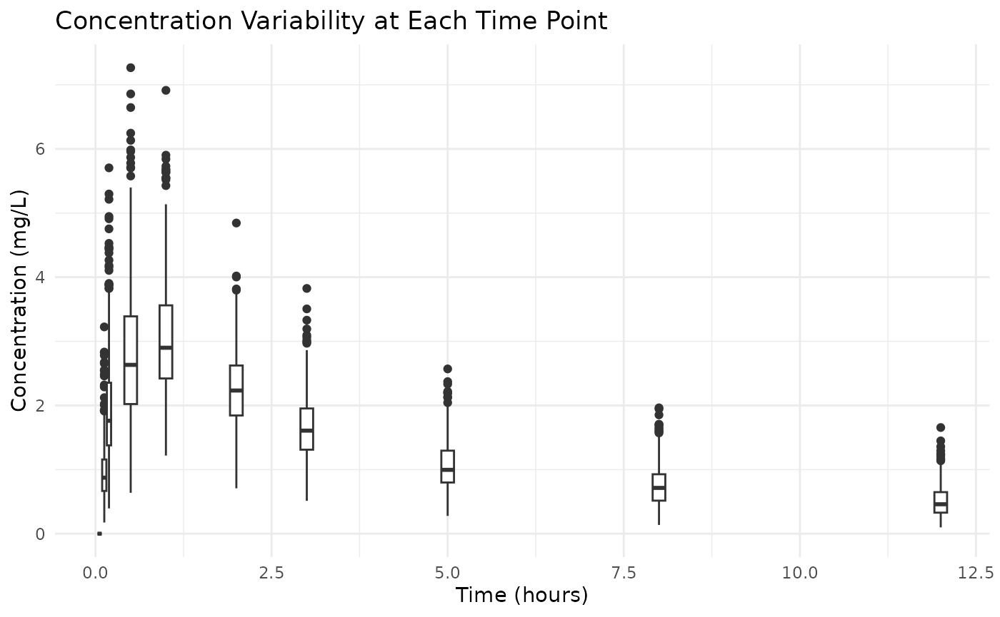
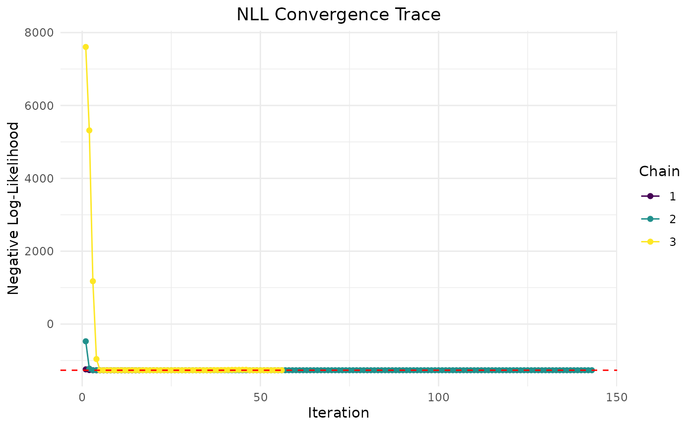
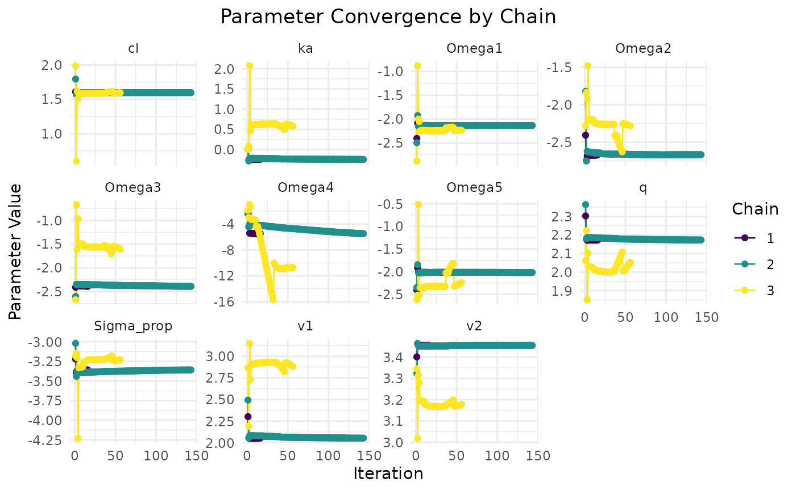
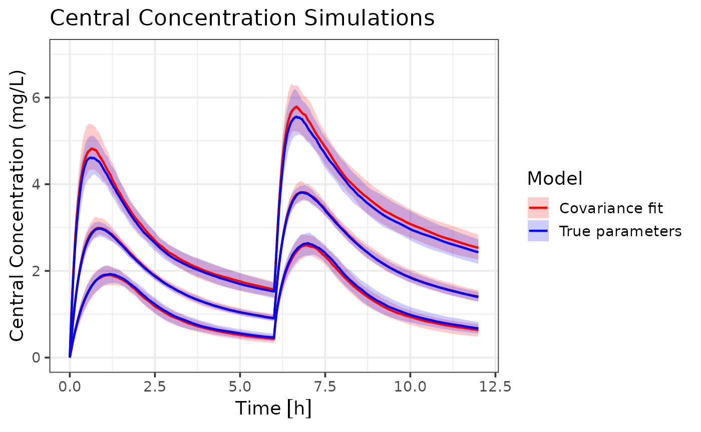
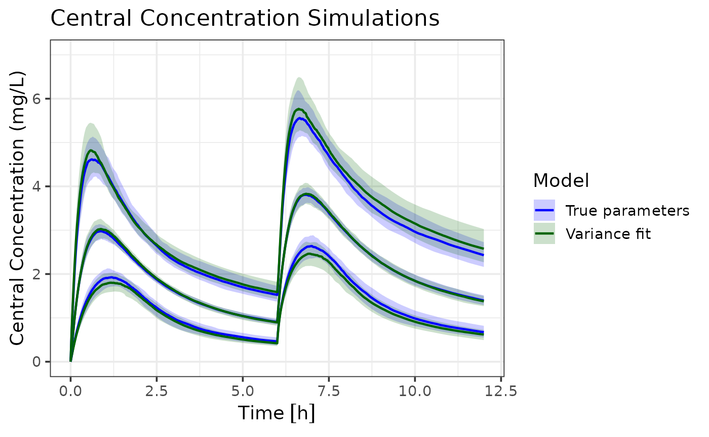

# Variance-only based modelling with admr

## Variance based modelling

This vignette provides an introduction to variance-based modeling using
the `admr` package in R. We’ll cover the essential steps to prepare your
data, specify a pharmacokinetic model, fit the model to aggregate data,
and evaluate the results. We’ll compare the results of using mean and
variance only data to the full mean and covariance data. Variance based
modeling is particularly useful when complex aggregate data is not
available, and only means and variances are reported.

The `admr` package implements the Iterative Reweighting Monte Carlo
(IRMC) algorithm, which efficiently fits models to aggregate data by
iteratively updating parameter estimates using weighted importance
sampling.

### Required Packages

First, we need to load the necessary packages:

Click here

``` r
library(admr)
library(rxode2)
library(nlmixr2)
library(dplyr)
library(tidyr)
library(mnorm)
library(ggplot2)  # For visualization
library(units)
```

### Understanding the Data Format

The `admr` package works with two types of data formats:

1.  **Raw Data**: Individual-level observations in a wide or long
    format.
2.  **Aggregate Data**: Summary statistics (mean and covariance)
    computed from raw data.
3.  **Aggregate Data with only means and variance**: Mean and variance
    for each time point (no covariances).

Let’s look at the examplomycin dataset, which we’ll use throughout this
vignette:

``` r
# Load the dataset
data(examplomycin)
head(examplomycin)
```

    ##    ID TIME    DV AMT EVID CMT
    ## 1 460 0.00 0.000 100  101   1
    ## 2 460 0.10 0.752   0    0   2
    ## 3 460 0.25 1.932   0    0   2
    ## 4 460 0.50 3.694   0    0   2
    ## 5 460 1.00 3.479   0    0   2
    ## 6 460 2.00 4.003   0    0   2

``` r
# Basic dataset information
cat("Number of subjects:", length(unique(examplomycin$ID)), "\n")
```

    ## Number of subjects: 500

``` r
cat("Number of time points:", length(unique(examplomycin$TIME)), "\n")
```

    ## Number of time points: 10

``` r
cat("Time points:", paste(sort(unique(examplomycin$TIME)), collapse = ", "), "\n")
```

    ## Time points: 0, 0.1, 0.25, 0.5, 1, 2, 3, 5, 8, 12

### Data Preparation

#### Converting Raw Data to Aggregate Format

The first step is to convert our simulated raw data into aggregate
format. Then, we will create two versions of the aggregated data: one
with mean and covariance, and another with mean and variance only. In
real-world scenarios, you will not have access to the raw data, but this
step is included here for demonstration purposes.

Click here

``` r
# Convert to wide format
examplomycin_wide <- examplomycin %>%
  filter(EVID != 101) %>%  # Remove dosing events
  dplyr::select(ID, TIME, DV) %>%  # Select relevant columns
  pivot_wider(names_from = TIME, values_from = DV) %>%  # Convert to wide format
  dplyr::select(-c(1))  # Remove ID column

# Create aggregated data
examplomycin_aggregated <- examplomycin_wide %>%
  admr::meancov()  # Compute mean and covariance

# View the structure of aggregated data
examplomycin_aggregated
```

    ## $E
    ##      0.1     0.25      0.5        1        2        3        5        8 
    ## 0.966418 1.938774 2.787908 3.024706 2.257656 1.650808 1.063120 0.751180 
    ##       12 
    ## 0.512168 
    ## 
    ## $V
    ##               0.1         0.25         0.5           1          2           3
    ## 0.1   0.210318331  0.307810566  0.34863077 0.202610737 0.02244783 -0.04472722
    ## 0.25  0.307810566  0.707512991  0.65887098 0.416118052 0.05871261 -0.07441765
    ## 0.5   0.348630772  0.658870977  1.09983366 0.530554165 0.10572618 -0.07538386
    ## 1     0.202610737  0.416118052  0.53055416 0.803744604 0.16252833  0.02792441
    ## 2     0.022447834  0.058712608  0.10572618 0.162528331 0.34465070  0.12026872
    ## 3    -0.044727222 -0.074417647 -0.07538386 0.027924410 0.12026872  0.24989260
    ## 5    -0.018976800 -0.042420657 -0.04648286 0.001618855 0.07644080  0.11148574
    ## 8    -0.006630907 -0.011273701 -0.01981830 0.016197981 0.06398700  0.07493319
    ## 12   -0.005625994 -0.005018766 -0.01492001 0.014748325 0.04941463  0.05460018
    ##                 5            8           12
    ## 0.1  -0.018976800 -0.006630907 -0.005625994
    ## 0.25 -0.042420657 -0.011273701 -0.005018766
    ## 0.5  -0.046482865 -0.019818299 -0.014920009
    ## 1     0.001618855  0.016197981  0.014748325
    ## 2     0.076440801  0.063987002  0.049414630
    ## 3     0.111485737  0.074933189  0.054600176
    ## 5     0.154215442  0.087680168  0.061332530
    ## 8     0.087680168  0.096530356  0.057621124
    ## 12    0.061332530  0.057621124  0.057988752

``` r
# Transform into mean and variance only format
examplomycin_aggregated_var <- examplomycin_aggregated
examplomycin_aggregated_var$V <- diag(diag(examplomycin_aggregated_var$V))

# View the structure of mean and variance only data
examplomycin_aggregated_var
```

    ## $E
    ##      0.1     0.25      0.5        1        2        3        5        8 
    ## 0.966418 1.938774 2.787908 3.024706 2.257656 1.650808 1.063120 0.751180 
    ##       12 
    ## 0.512168 
    ## 
    ## $V
    ##            [,1]     [,2]     [,3]      [,4]      [,5]      [,6]      [,7]
    ##  [1,] 0.2103183 0.000000 0.000000 0.0000000 0.0000000 0.0000000 0.0000000
    ##  [2,] 0.0000000 0.707513 0.000000 0.0000000 0.0000000 0.0000000 0.0000000
    ##  [3,] 0.0000000 0.000000 1.099834 0.0000000 0.0000000 0.0000000 0.0000000
    ##  [4,] 0.0000000 0.000000 0.000000 0.8037446 0.0000000 0.0000000 0.0000000
    ##  [5,] 0.0000000 0.000000 0.000000 0.0000000 0.3446507 0.0000000 0.0000000
    ##  [6,] 0.0000000 0.000000 0.000000 0.0000000 0.0000000 0.2498926 0.0000000
    ##  [7,] 0.0000000 0.000000 0.000000 0.0000000 0.0000000 0.0000000 0.1542154
    ##  [8,] 0.0000000 0.000000 0.000000 0.0000000 0.0000000 0.0000000 0.0000000
    ##  [9,] 0.0000000 0.000000 0.000000 0.0000000 0.0000000 0.0000000 0.0000000
    ##             [,8]       [,9]
    ##  [1,] 0.00000000 0.00000000
    ##  [2,] 0.00000000 0.00000000
    ##  [3,] 0.00000000 0.00000000
    ##  [4,] 0.00000000 0.00000000
    ##  [5,] 0.00000000 0.00000000
    ##  [6,] 0.00000000 0.00000000
    ##  [7,] 0.00000000 0.00000000
    ##  [8,] 0.09653036 0.00000000
    ##  [9,] 0.00000000 0.05798875

#### Visualizing the Data

Before fitting the model, it’s helpful to visualize the data:

``` r
# Boxplot to visualize variability
ggplot(examplomycin, aes(x = TIME, y = DV, group = TIME)) +
  geom_boxplot(aes(group = TIME), width = 0.2) +
  labs(
    title = "Concentration Variability at Each Time Point",
    x = "Time (hours)",
    y = "Concentration (mg/L)"
  ) +
  theme_minimal()
```



### Model Specification

#### Defining the Pharmacokinetic Model

We’ll use a solved two-compartment model with first-order absorption:

Click here

``` r
# Define RxODE model
rxModel <- function(){
  model({
    cp = linCmt(
      cl,           # Clearance
      v1,           # Volume of central compartment
      v2,           # Volume of peripheral compartment
      q,            # Inter-compartmental clearance
      ka            # Absorption rate constant
    )})
}

rxModel <- rxode2(rxModel)
rxModel <- rxModel$simulationModel
```

#### Creating the Prediction Function

The prediction function is crucial for the `admr` package. It: -
Constructs the event table for dosing and sampling - Solves the RxODE
model - Returns predicted concentrations in the required format

``` r
rxode2::rxSetSilentErr(1)
```

    ## [1] TRUE

``` r
predder <- function(time, theta_i, dose = 100) {
    n_individuals <- nrow(theta_i)
    
    if (is.null(n_individuals)) {
      n_individuals <- 1
    }

    # Create event table
    ev <- eventTable(amount.units="mg", time.units="hours")
    ev$add.dosing(dose = dose, nbr.doses = 1, start.time = 0)
    ev$add.sampling(time)
    
    # Solve model
    out <- rxSolve(rxModel, params = theta_i, events = ev, cores = 0)
    
    # Format output
    cp_matrix <- matrix(out$cp, nrow = n_individuals, ncol = length(time), 
                        byrow = TRUE)
    
    return(cp_matrix)
}
```

It can be observed that all steps for variance based modeling are
similar to the mean and covariance based modeling. The only difference
is in the data that is used for fitting the model.

### Model Fitting

#### Setting Up Model Options

The `genopts` function creates an options object that controls the model
fitting process. We’ll do this twice: once for mean and covariance data,
and once for mean and variance only data.

Click here

``` r
opts_covar <- genopts(
  time = c(.1, .25, .5, 1, 2, 3, 5, 8, 12),  # Observation times
  p = list(
    beta = c(cl = 5, v1 = 10, v2 = 30, q = 10, ka = 1),  # Population parameters
    Omega = matrix(c(0.09, 0, 0, 0, 0,
                    0, 0.09, 0, 0, 0,
                    0, 0, 0.09, 0, 0,
                    0, 0, 0, 0.09, 0,
                    0, 0, 0, 0, 0.09), nrow = 5, ncol = 5),  # Random effects
    Sigma_prop = 0.04  # Proportional error
  ),
  nsim = 10000,  # Number of Monte Carlo samples
  n = 500,      # Number of individuals
  fo_appr = FALSE,  # Disable first-order approximation
  omega_expansion = 1,  # Omega expansion factor
  f = predder,    # Prediction function
  no_cov = FALSE # Use mean and covariance format
)


opts_var <- genopts(
  time = c(.1, .25, .5, 1, 2, 3, 5, 8, 12),  # Observation times
  p = list(
    beta = c(cl = 5, v1 = 10, v2 = 30, q = 10, ka = 1),  # Population parameters
    Omega = matrix(c(0.09, 0, 0, 0, 0,
                    0, 0.09, 0, 0, 0,
                    0, 0, 0.09, 0, 0,
                    0, 0, 0, 0.09, 0,
                    0, 0, 0, 0, 0.09), nrow = 5, ncol = 5),  # Random effects
    Sigma_prop = 0.04  # Proportional error
  ),
  nsim = 10000,  # Number of Monte Carlo samples
  n = 500,      # Number of individuals
  fo_appr = FALSE,  # Disable first-order approximation
  omega_expansion = 1,  # Omega expansion factor
  f = predder,    # Prediction function
  no_cov = TRUE # Use mean and variance only format
)
```

The only difference between the two options is the `no_cov` argument,
which is set to `TRUE` for variance only data and `FALSE` for mean and
covariance data.

#### Fitting the Model

The `fitIRMC` function fits the model using the IRMC algorithm:

``` r
fit.var <- admr::fitIRMC(
  opts = opts_var,
  obs = examplomycin_aggregated_var,
  chains = 6,  # Number of chains
  maxiter = 200,  # Maximum iterations
  use_grad = T
)
```

    ## Chain 1:
    ## Iter | NLL and Parameters (11 values)
    ## --------------------------------------------------------------------------------
    ##    1: -1242.386    1.609    2.303    3.401    2.303    0.000   -2.408   -2.408   -2.408   -2.408   -2.408   -3.219
    ## 
    ## ### Wide Search Phase ###
    ##    2: -1261.578    1.593    2.057    3.463    2.177   -0.260   -2.086   -2.749   -2.349   -4.408   -1.914   -3.388
    ##    3: -1266.407    1.598    2.055    3.456    2.172   -0.243   -2.126   -2.762   -2.352   -4.408   -1.966   -3.423
    ##    4: -1266.408    1.598    2.054    3.456    2.173   -0.243   -2.126   -2.762   -2.352   -4.408   -1.966   -3.423
    ##    5: -1266.409    1.598    2.054    3.456    2.173   -0.243   -2.127   -2.762   -2.351   -4.408   -1.966   -3.422
    ## Phase Wide Search Phase converged at iteration 5.
    ## 
    ## ### Focussed Search Phase ###
    ##    6: -1266.409    1.598    2.054    3.456    2.173   -0.243   -2.127   -2.762   -2.351   -4.408   -1.967   -3.422
    ## Phase Focussed Search Phase converged at iteration 6.
    ## 
    ## ### Fine-Tuning Phase ###
    ##    7: -1266.409    1.598    2.054    3.456    2.173   -0.243   -2.127   -2.762   -2.351   -4.408   -1.967   -3.422
    ##    8: -1266.410    1.598    2.054    3.456    2.173   -0.243   -2.127   -2.762   -2.351   -4.408   -1.967   -3.421
    ## Phase Fine-Tuning Phase converged at iteration 8.
    ## 
    ## ### Precision Phase ###
    ##    9: -1266.410    1.598    2.054    3.456    2.173   -0.243   -2.127   -2.762   -2.351   -4.408   -1.967   -3.421
    ##   10: -1266.411    1.598    2.054    3.457    2.173   -0.243   -2.128   -2.762   -2.351   -4.408   -1.967   -3.420
    ## Phase Precision Phase converged at iteration 10.
    ## 
    ## Chain 1 Complete: Final NLL = -1266.411, Time Elapsed = 8.99 seconds
    ##  
    ## Phase Wide Search Phase converged at iteration 5.
    ## Phase Focussed Search Phase converged at iteration 6.
    ## Phase Fine-Tuning Phase converged at iteration 7.
    ## Phase Precision Phase converged at iteration 8.
    ## 
    ## Chain 2 Complete: Final NLL = -1266.426, Time Elapsed = 11.01 seconds
    ##  
    ## Phase Wide Search Phase converged at iteration 7.
    ## Phase Focussed Search Phase converged at iteration 9.
    ## Phase Fine-Tuning Phase converged at iteration 11.
    ## Phase Precision Phase converged at iteration 13.
    ## 
    ## Chain 3 Complete: Final NLL = -1266.157, Time Elapsed = 9.14 seconds
    ##  
    ## Phase Wide Search Phase converged at iteration 5.
    ## Phase Focussed Search Phase converged at iteration 6.
    ## Phase Fine-Tuning Phase converged at iteration 10.
    ## Phase Precision Phase converged at iteration 11.
    ## 
    ## Chain 4 Complete: Final NLL = -1266.431, Time Elapsed = 12.41 seconds
    ##  
    ## Phase Wide Search Phase converged at iteration 5.
    ## Phase Focussed Search Phase converged at iteration 7.
    ## Phase Fine-Tuning Phase converged at iteration 9.
    ## Phase Precision Phase converged at iteration 11.
    ## 
    ## Chain 5 Complete: Final NLL = -1266.439, Time Elapsed = 12.61 seconds
    ##  
    ## Phase Focussed Search Phase converged at iteration 17.
    ## Phase Fine-Tuning Phase converged at iteration 18.
    ## Phase Precision Phase converged at iteration 19.
    ## 
    ## Chain 6 Complete: Final NLL = -1266.379, Time Elapsed = 42.69 seconds
    ## 

``` r
fit.covar <- admr::fitIRMC(
  opts = opts_covar,
  obs = examplomycin_aggregated,
  chains = 2,  # Number of chains
  maxiter = 200,  # Maximum iterations
  use_grad = T
)
```

    ## Chain 1:
    ## Iter | NLL and Parameters (11 values)
    ## --------------------------------------------------------------------------------
    ##    1: -1839.520    1.609    2.303    3.401    2.303    0.000   -2.408   -2.408   -2.408   -2.408   -2.408   -3.219
    ## 
    ## ### Wide Search Phase ###
    ##    2: -1845.306    1.601    2.324    3.399    2.285    0.032   -2.274   -2.183   -2.325   -2.210   -2.418   -3.236
    ##    3: -1845.355    1.601    2.317    3.401    2.285    0.026   -2.283   -2.218   -2.338   -2.239   -2.387   -3.235
    ##    4: -1845.355    1.601    2.317    3.401    2.285    0.026   -2.283   -2.218   -2.338   -2.239   -2.387   -3.235
    ##    5: -1845.355    1.601    2.317    3.401    2.285    0.026   -2.283   -2.218   -2.338   -2.239   -2.387   -3.235
    ##    6: -1845.355    1.601    2.317    3.401    2.285    0.026   -2.282   -2.218   -2.338   -2.239   -2.387   -3.235
    ##    7: -1845.355    1.601    2.317    3.401    2.285    0.026   -2.282   -2.218   -2.338   -2.239   -2.387   -3.235
    ## Phase Wide Search Phase converged at iteration 7.
    ## 
    ## ### Focussed Search Phase ###
    ##    8: -1845.355    1.601    2.317    3.401    2.285    0.026   -2.283   -2.218   -2.338   -2.239   -2.387   -3.235
    ##    9: -1845.355    1.601    2.317    3.401    2.285    0.026   -2.283   -2.218   -2.338   -2.239   -2.387   -3.235
    ##   10: -1845.355    1.601    2.317    3.401    2.285    0.026   -2.282   -2.218   -2.338   -2.239   -2.387   -3.235
    ##   11: -1845.355    1.601    2.317    3.401    2.285    0.026   -2.282   -2.218   -2.338   -2.239   -2.387   -3.235
    ## Phase Focussed Search Phase converged at iteration 11.
    ## 
    ## ### Fine-Tuning Phase ###
    ##   12: -1845.355    1.601    2.317    3.401    2.285    0.026   -2.283   -2.218   -2.338   -2.239   -2.387   -3.235
    ##   13: -1845.355    1.601    2.317    3.401    2.285    0.026   -2.283   -2.218   -2.338   -2.239   -2.387   -3.235
    ##   14: -1845.355    1.601    2.317    3.401    2.285    0.026   -2.282   -2.218   -2.338   -2.239   -2.387   -3.235
    ##   15: -1845.355    1.601    2.317    3.401    2.285    0.026   -2.282   -2.218   -2.338   -2.239   -2.387   -3.235
    ## Phase Fine-Tuning Phase converged at iteration 15.
    ## 
    ## ### Precision Phase ###
    ##   16: -1845.355    1.601    2.317    3.401    2.285    0.026   -2.283   -2.218   -2.338   -2.239   -2.387   -3.235
    ##   17: -1845.355    1.601    2.317    3.401    2.285    0.026   -2.283   -2.218   -2.338   -2.239   -2.387   -3.235
    ##   18: -1845.355    1.601    2.317    3.401    2.285    0.026   -2.282   -2.218   -2.338   -2.239   -2.387   -3.235
    ##   19: -1845.355    1.601    2.317    3.401    2.285    0.026   -2.282   -2.218   -2.338   -2.239   -2.387   -3.235
    ## Phase Precision Phase converged at iteration 19.
    ## 
    ## Chain 1 Complete: Final NLL = -1845.355, Time Elapsed = 11.60 seconds
    ##  
    ## Phase Wide Search Phase converged at iteration 20.
    ## Phase Focussed Search Phase converged at iteration 21.
    ## Phase Fine-Tuning Phase converged at iteration 24.
    ## Phase Precision Phase converged at iteration 32.
    ## 
    ## Chain 2 Complete: Final NLL = -1845.353, Time Elapsed = 25.32 seconds
    ## 

Convergence speeds up a lot for the variance fit when using gradients,
as the optimization landscape is more challenging with less information.
However NLL is slightly worse than without gradients. This is likely due
to local minima issues, which can be alleviated by using more chains,
larger MC samples, or more iterations.

### Model Diagnostics

#### Basic Diagnostics

The `print` method provides a summary of the model fit:

``` r
print(fit.var)
```

    ## -- FitIRMC Summary --
    ## 
    ## -- Objective Function and Information Criteria --
    ##  Log-likelihood: -1266.4385
    ##             AIC: 2543.88
    ##             BIC: 2601.24
    ## Condition#(Cov): 514.83
    ## Condition#(Cor): 737.47
    ## 
    ## -- Timing Information --
    ##      Best Chain: 12.6118 seconds
    ##      All Chains: 96.8491 seconds
    ##      Covariance: 20.2707 seconds
    ##         Elapsed: 117.12 seconds
    ## 
    ## -- Population Parameters --
    ## # A tibble: 6 × 6
    ##   Parameter         Est.      SE `%RSE` `Back-transformed(95%CI)` `BSV(CV%)`
    ##   <chr>            <dbl>   <dbl>  <dbl> <chr>                          <dbl>
    ## 1 cl              1.60    0.0159  0.995 4.94 (4.79, 5.10)              34.3 
    ## 2 v1              2.06    0.0819  3.97  7.86 (6.70, 9.23)              27.3 
    ## 3 v2              3.46    0.0397  1.15  31.68 (29.31, 34.25)           30.3 
    ## 4 q               2.18    0.0286  1.31  8.82 (8.34, 9.33)               8.09
    ## 5 ka             -0.234   0.0758 32.4   0.79 (0.68, 0.92)              35.9 
    ## 6 Residual Error  0.0351 NA      NA     0.0351                         NA   
    ## 
    ## -- Iteration Diagnostics --
    ##  Iter | NLL and Parameters
    ## --------------------------------------------------------------------------------
    ##    1: -937.937 1.682 2.298 3.293 2.089 0.000 -2.766 -2.667 -2.167 -2.558 -2.741 -2.617
    ##    2: -1209.506 1.576 2.086 3.474 2.210 -0.244 -1.967 -3.194 -1.904 -3.030 -1.917 -3.571
    ##    3: -1266.274 1.597 2.056 3.454 2.174 -0.241 -2.141 -2.574 -2.386 -5.030 -2.038 -3.361
    ##    4: -1266.427 1.597 2.060 3.456 2.175 -0.237 -2.133 -2.583 -2.385 -5.030 -2.054 -3.362
    ##    5: -1266.428 1.597 2.060 3.456 2.175 -0.237 -2.133 -2.584 -2.385 -5.030 -2.054 -3.361
    ##    ... (omitted iterations) ...
    ##    7: -1266.431 1.597 2.060 3.457 2.175 -0.237 -2.133 -2.586 -2.385 -5.030 -2.053 -3.358
    ##    8: -1266.432 1.597 2.060 3.457 2.175 -0.237 -2.134 -2.586 -2.385 -5.030 -2.053 -3.358
    ##    9: -1266.432 1.597 2.060 3.457 2.175 -0.236 -2.134 -2.586 -2.385 -5.030 -2.053 -3.358
    ##   10: -1266.438 1.597 2.062 3.456 2.177 -0.234 -2.139 -2.596 -2.385 -5.030 -2.051 -3.351
    ##   11: -1266.439 1.597 2.062 3.456 2.177 -0.234 -2.139 -2.596 -2.385 -5.030 -2.051 -3.351

``` r
print(fit.covar)
```

    ## -- FitIRMC Summary --
    ## 
    ## -- Objective Function and Information Criteria --
    ##  Log-likelihood: -1845.3554
    ##             AIC: 3701.71
    ##             BIC: 3759.07
    ## Condition#(Cov): 152.17
    ## Condition#(Cor): 216.85
    ## 
    ## -- Timing Information --
    ##      Best Chain: 11.6023 seconds
    ##      All Chains: 36.9287 seconds
    ##      Covariance: 20.1877 seconds
    ##         Elapsed: 57.12 seconds
    ## 
    ## -- Population Parameters --
    ## # A tibble: 6 × 6
    ##   Parameter        Est.      SE  `%RSE` `Back-transformed(95%CI)` `BSV(CV%)`
    ##   <chr>           <dbl>   <dbl>   <dbl> <chr>                          <dbl>
    ## 1 cl             1.60    0.0152   0.950 4.96 (4.81, 5.11)               31.9
    ## 2 v1             2.32    0.0865   3.73  10.14 (8.56, 12.02)             33.0
    ## 3 v2             3.40    0.0400   1.18  30.00 (27.74, 32.45)            31.1
    ## 4 q              2.29    0.0212   0.928 9.83 (9.43, 10.24)              32.6
    ## 5 ka             0.0263  0.0817 311.    1.03 (0.87, 1.20)               30.3
    ## 6 Residual Error 0.0394 NA       NA     0.0394                          NA  
    ## 
    ## -- Iteration Diagnostics --
    ##  Iter | NLL and Parameters
    ## --------------------------------------------------------------------------------
    ##    1: -1839.520 1.609 2.303 3.401 2.303 0.000 -2.408 -2.408 -2.408 -2.408 -2.408 -3.219
    ##    2: -1845.306 1.601 2.324 3.399 2.285 0.032 -2.274 -2.183 -2.325 -2.210 -2.418 -3.236
    ##    3: -1845.355 1.601 2.317 3.401 2.285 0.026 -2.283 -2.218 -2.338 -2.239 -2.387 -3.235
    ##    4: -1845.355 1.601 2.317 3.401 2.285 0.026 -2.283 -2.218 -2.338 -2.239 -2.387 -3.235
    ##    5: -1845.355 1.601 2.317 3.401 2.285 0.026 -2.283 -2.218 -2.338 -2.239 -2.387 -3.235
    ##    ... (omitted iterations) ...
    ##   15: -1845.355 1.601 2.317 3.401 2.285 0.026 -2.282 -2.218 -2.338 -2.239 -2.387 -3.235
    ##   16: -1845.355 1.601 2.317 3.401 2.285 0.026 -2.283 -2.218 -2.338 -2.239 -2.387 -3.235
    ##   17: -1845.355 1.601 2.317 3.401 2.285 0.026 -2.283 -2.218 -2.338 -2.239 -2.387 -3.235
    ##   18: -1845.355 1.601 2.317 3.401 2.285 0.026 -2.282 -2.218 -2.338 -2.239 -2.387 -3.235
    ##   19: -1845.355 1.601 2.317 3.401 2.285 0.026 -2.282 -2.218 -2.338 -2.239 -2.387 -3.235

#### Convergence Assessment

The `plot` method visualizes the convergence of the model fit:

``` r
plot(fit.var)
```


First variance only data is plotted. We see that the model converges
reasonbly well within the specified iterations, with some parameters
showing more variability across chains.

Now we plot the mean and covariance data fit:

``` r
plot(fit.covar)
```


This data seems to converge slightly better, especially when looking at
chain comparisons. All chains converge to similar values, whereas in the
variance only data, the chains show more variability while resulting in
the same NLL. This is due to non-identifiability issues of some
parameters when only variance data is used.

#### True vs Estimated Parameters

Given that true parameter estimates are known, we can compare the
estimated parameters to the true values:

``` r
params.true <- list(
  beta = c(cl = 5, v1 = 10, v2 = 30, q = 10, ka = 1),
  Omega = diag(rep(0.09, 5)),
  Sigma_prop = 0.04
)
cat("True parameter values:\n")
```

    ## True parameter values:

``` r
print(params.true)
```

    ## $beta
    ## cl v1 v2  q ka 
    ##  5 10 30 10  1 
    ## 
    ## $Omega
    ##      [,1] [,2] [,3] [,4] [,5]
    ## [1,] 0.09 0.00 0.00 0.00 0.00
    ## [2,] 0.00 0.09 0.00 0.00 0.00
    ## [3,] 0.00 0.00 0.09 0.00 0.00
    ## [4,] 0.00 0.00 0.00 0.09 0.00
    ## [5,] 0.00 0.00 0.00 0.00 0.09
    ## 
    ## $Sigma_prop
    ## [1] 0.04

``` r
cat("Estimated parameters (mean and variance only):\n")
```

    ## Estimated parameters (mean and variance only):

``` r
print(fit.var$transformed_params)
```

    ## $beta
    ##         cl         v1         v2          q         ka 
    ##  4.9395278  7.8628171 31.6804687  8.8216025  0.7913313 
    ## 
    ## $Omega
    ##           [,1]       [,2]       [,3]        [,4]      [,5]
    ## [1,] 0.1177831 0.00000000 0.00000000 0.000000000 0.0000000
    ## [2,] 0.0000000 0.07456556 0.00000000 0.000000000 0.0000000
    ## [3,] 0.0000000 0.00000000 0.09204889 0.000000000 0.0000000
    ## [4,] 0.0000000 0.00000000 0.00000000 0.006541875 0.0000000
    ## [5,] 0.0000000 0.00000000 0.00000000 0.000000000 0.1285627
    ## 
    ## $Sigma_prop
    ## [1] 0.03506213

We observe that both methods recover the true parameters reasonably
well, but the mean and covariance method provides more accurate
estimates due to the additional information from covariances. In this
example model, especially inter-compartmental clearance (q) and its
random effect are more challenging to estimate accurately with only
variance data. However, using larger sample sizes from more studies will
help improve the estimates from both data. To further illustrate the
differences in dynamics, we can simulate concentration-time profiles
using the true parameters and the estimated parameters from both
methods.

#### Dosing plot with Confidence Intervals for true vs estimated parameters

Let’s simulate concentration-time profiles using the true parameters and
the estimated parameters from both methods, and then plot the results
with confidence intervals. First, we define the models using the true
parameters and the estimated parameters from both methods:

Click here

``` r
params.true <- list(
  beta = c(cl = 5, v1 = 10, v2 = 30, q = 10, ka = 1),
  Omega = diag(rep(0.09, 5)),
  Sigma_prop = 0.04
)

params.covar <- fit.covar$transformed_params
params.var <- fit.var$transformed_params

rxModel_true <- function(){
  ini({
    cl <- params.true$beta["cl"]  # Clearance
    v1 <- params.true$beta["v1"]  # Volume of central compartment
    v2 <- params.true$beta["v2"] # Volume of peripheral compartment
    q <- params.true$beta["q"]    # Inter-compartmental clearance
    ka <- params.true$beta["ka"]   # Absorption rate constant

    eta_cl ~ params.true$Omega[1,1]
    eta_v1 ~ params.true$Omega[2,2]
    eta_v2 ~ params.true$Omega[3,3]
    eta_q ~ params.true$Omega[4,4]
    eta_ka ~ params.true$Omega[5,5]
  })
  model({
    cl <- cl * exp(eta_cl)
    v1 <- v1 * exp(eta_v1)
    v2 <- v2 * exp(eta_v2)
    q <- q * exp(eta_q)
    ka <- ka * exp(eta_ka)
    cp = linCmt(cl, v1, v2, q, ka)
  })
}
rxModel_covar <- function(){
  ini({
    cl <- params.covar$beta["cl"]  # Clearance
    v1 <- params.covar$beta["v1"]  # Volume of central compartment
    v2 <- params.covar$beta["v2"] # Volume of peripheral compartment
    q <- params.covar$beta["q"]    # Inter-compartmental clearance
    ka <- params.covar$beta["ka"]   # Absorption rate constant

    eta_cl ~ params.covar$Omega[1,1]
    eta_v1 ~ params.covar$Omega[2,2]
    eta_v2 ~ params.covar$Omega[3,3]
    eta_q ~ params.covar$Omega[4,4]
    eta_ka ~ params.covar$Omega[5,5]
  })
  model({
    cl <- cl * exp(eta_cl)
    v1 <- v1 * exp(eta_v1)
    v2 <- v2 * exp(eta_v2)
    q <- q * exp(eta_q)
    ka <- ka * exp(eta_ka)
    cp = linCmt(cl, v1, v2, q, ka)
  })
}
rxModel_var <- function(){
  ini({
    cl <- params.var$beta["cl"]  # Clearance
    v1 <- params.var$beta["v1"]  # Volume of central compartment
    v2 <- params.var$beta["v2"] # Volume of peripheral compartment
    q <- params.var$beta["q"]    # Inter-compartmental clearance
    ka <- params.var$beta["ka"]   # Absorption rate constant

    eta_cl ~ params.var$Omega[1,1]
    eta_v1 ~ params.var$Omega[2,2]
    eta_v2 ~ params.var$Omega[3,3]
    eta_q ~ params.var$Omega[4,4]
    eta_ka ~ params.var$Omega[5,5]
  })
  model({
    cl <- cl * exp(eta_cl)
    v1 <- v1 * exp(eta_v1)
    v2 <- v2 * exp(eta_v2)
    q <- q * exp(eta_q)
    ka <- ka * exp(eta_ka)
    cp = linCmt(cl, v1, v2, q, ka)
  })
}

rxModel_true <- rxode2(rxModel_true())
rxModel_true <- rxModel_true$simulationModel
rxModel_covar <- rxode2(rxModel_covar())
rxModel_covar <- rxModel_covar$simulationModel
rxModel_var <- rxode2(rxModel_var())
rxModel_var <- rxModel_var$simulationModel
```

Now we can simulate the concentration-time profiles and plot the
results:

``` r
time_points <- seq(0, 12, by = 0.01)  # Dense time points for smooth curves
ev <- eventTable(amount.units="mg", time.units="hours")
ev$add.dosing(dose = 100, nbr.doses = 2, dosing.interval = 6)
ev$add.sampling(time_points)


sim_true <- rxSolve(rxModel_true, events = ev, cores = 0, nSub = 10000)
sim_covar <- rxSolve(rxModel_covar, events = ev, cores = 0, nSub = 10000)
sim_var <- rxSolve(rxModel_var, events = ev, cores = 0, nSub = 10000)

# Combine the confidence intervals with a label for the model
ci_true <- as.data.frame(confint(sim_true, "cp", level=0.95)) %>%
  mutate(Model = "True parameters")
```

    ## summarizing data...done

``` r
ci_covar <- as.data.frame(confint(sim_covar, "cp", level=0.95)) %>%
  mutate(Model = "Covariance fit")
```

    ## summarizing data...done

``` r
ci_var <- as.data.frame(confint(sim_var, "cp", level=0.95)) %>%
  mutate(Model = "Variance fit")
```

    ## summarizing data...done

``` r
# Bind them together
ci_true_covar <- bind_rows(ci_true, ci_covar) %>%
  mutate(
    p1 = as.numeric(as.character(p1)),
    Percentile = factor(Percentile, levels = unique(Percentile[order(p1)]))
  )

ci_true_var <- bind_rows(ci_true, ci_var) %>%
  mutate(
    p1 = as.numeric(as.character(p1)),
    Percentile = factor(Percentile, levels = unique(Percentile[order(p1)]))
  )


# Plot both models
ggplot(ci_true_covar, aes(x = time, group = interaction(Model, Percentile))) +
  geom_ribbon(aes(ymin = p2.5, ymax = p97.5, fill = Model),
              alpha = 0.2, colour = NA) +
  geom_line(aes(y = p50, colour = Model), size = 0.8) +
  labs(
    title = "Central Concentration Simulations",
    x = "Time",
    y = "Central Concentration (mg/L)"
  ) +
  theme_bw(base_size = 14) +
  scale_colour_manual(values = c("True parameters" = "blue",
                                 "Covariance fit" = "red")) +
  scale_fill_manual(values = c("True parameters" = "blue",
                               "Covariance fit" = "red")) +
  coord_cartesian(xlim = c(0, 12), ylim = c(0, 7))
```

    ## Warning: Using `size` aesthetic for lines was deprecated in ggplot2 3.4.0.
    ## ℹ Please use `linewidth` instead.
    ## This warning is displayed once every 8 hours.
    ## Call `lifecycle::last_lifecycle_warnings()` to see where this warning was
    ## generated.



``` r
ggplot(ci_true_var, aes(x = time, group = interaction(Model, Percentile))) +
  geom_ribbon(aes(ymin = p2.5, ymax = p97.5, fill = Model),
              alpha = 0.2, colour = NA) +
  geom_line(aes(y = p50, colour = Model), size = 0.8) +
  labs(
    title = "Central Concentration Simulations",
    x = "Time",
    y = "Central Concentration (mg/L)"
  ) +
  theme_bw(base_size = 14) +
  scale_colour_manual(values = c("True parameters" = "blue",
                                 "Variance fit" = "darkgreen")) +
  scale_fill_manual(values = c("True parameters" = "blue",
                                 "Variance fit" = "darkgreen")) +
  coord_cartesian(xlim = c(0, 12), ylim = c(0, 7))
```

 Both models
capture the central tendency of the true parameters dynamics well.
However, the variance only model shows slightly wider population
intervals. In this scenario this isn’t very problematic, since a wider
range still captures the true dynamics. However, in other scenarios,
this could lead to over- or under-prediction of certain percentiles. The
estimation error is expected due to the reduced information content in
variance-only data.

### Best Practices

So to recap, here are some best practices for variance-based (but also
covariance-based) modeling with `admr`:

1.  **Data Preparation**:
    - Always check your data for missing values and outliers
    - Ensure time points are consistent across subjects
    - Consider the impact of dosing events on your analysis
2.  **Model Specification**:
    - Start with a simple model and gradually add complexity
    - Use meaningful initial values for parameters
    - Consider parameter transformations for better estimation
3.  **Model Fitting**:
    - Use multiple chains to improve optimization
    - Monitor convergence carefully
    - Check parameter estimates for biological plausibility
4.  **Diagnostics**:
    - Always examine convergence plots
    - Validate model predictions against observed data

For more information, see the package documentation and other vignettes.
